# API Events — CI/CD DevOps

Projet Node.js / Express réalisé dans le cadre de l’examen pratique CI/CD DevOps.

L’objectif du projet est de faire évoluer une API REST existante en ajoutant progressivement des bonnes pratiques DevOps : intégration continue, tests, sécurité, Docker, déploiement et observabilité.

### Phase 0 — Préparation du workflow CI

Le workflow GitHub Actions principal a été préparé et stabilisé.

Modifications réalisées :

* renommage du workflow principal en `.github/workflows/ci.yml`
* conservation des déclencheurs `push` et `pull_request`
* utilisation de `actions/setup-node@v4`
* utilisation de Node.js 20
* ajout/conservation du cache npm
* remplacement de `npm install` par `npm ci`
* conservation des tests backend
* conservation du job Playwright existant

## Phase 1 — CI avancée

La CI backend a été améliorée avec une configuration plus complète.

Modifications réalisées :

* ajout d’un service PostgreSQL `postgres:16` dans le job backend
* ajout d’un healthcheck PostgreSQL avec `pg_isready`
* ajout des variables d’environnement au niveau du job backend :

  * `API_PASSWORD`
  * `DATABASE_URL`
  * `NODE_ENV`
* lancement des tests Jest avec couverture :

  ```bash
  npm test -- --coverage
  ```
* upload du dossier `coverage/` comme artifact GitHub Actions nommé `test-report-backend`

## Phase 2 — Observabilité : route `/health`

Une route de vérification de santé de l’API a été ajoutée.

Route ajoutée :

```http
GET /health
```

Elle retourne un JSON contenant :

* `status`
* `timestamp`
* `env`
* `version`

Exemple de réponse :

```json
{
  "status": "ok",
  "timestamp": "2026-01-01T12:00:00.000Z",
  "env": "test",
  "version": "1.0.0"
}
```

Un test Supertest a également été ajouté pour vérifier que la route `/health` répond bien avec un code HTTP 200.

## Phase 3 — Vérification des variables d’environnement

Un script de vérification des variables d’environnement a été ajouté.

Fichier créé :

```bash
scripts/check-env.sh
```

Le script vérifie la présence des variables suivantes :

* `DATABASE_URL`
* `API_PASSWORD`
* `NODE_ENV`

Il est exécuté dans la CI avant les tests backend afin d’échouer rapidement si une variable importante est absente.

## Phase 4 - Docker / GHCR / Trivy / Dependabot

* Dockerfile present a la racine du projet.
* Image Docker publiee sur GHCR avec les tags `latest` et SHA.
* Scan Trivy visible dans les logs du workflow `build-publish`.
* Dependabot configure pour npm et GitHub Actions.

## Commandes utiles

Installer les dépendances :

```bash
npm ci
```

Lancer les tests :

```bash
npm test
```

Lancer les tests avec couverture :

```bash
npm test -- --coverage
```

Tester le script de vérification d’environnement en local :

```bash
DATABASE_URL="<production-database-url>" API_PASSWORD="<api-password>" NODE_ENV="production" bash scripts/check-env.sh
```

## Phase 5 - Deploiement staging / production

Le workflow `.github/workflows/deploy.yml` configure deux jobs :

* `deploy-staging` : declenche automatiquement le deploiement staging via un deploy hook Render.
* `deploy-production` : depend du staging avec `needs: deploy-staging` et utilise l'environnement GitHub `production`.

La validation manuelle de la production est configuree dans GitHub via les regles de protection de l'environnement `production`.

Secrets et environnements a configurer dans GitHub :

* environnement `staging`
* secret `RENDER_DEPLOY_HOOK=<render-deploy-hook-url>`
* environnement `production`
* required reviewer active

## Phase 6 - Observabilite avec UptimeRobot

La route `GET /health` permet de verifier que l'API est disponible.

Elle retourne un JSON avec :

* `status`
* `timestamp`
* `env`
* `version`

Un monitor UptimeRobot doit etre configure manuellement sur l'URL staging de l'API, avec le chemin `/health`.

Exemple :

```text
https://<render-staging-url>/health
```

Le monitor doit etre de type HTTP(s), avec un intervalle de 5 minutes et une alerte email.

Cette configuration permet de detecter automatiquement si l'API staging devient indisponible.

## Preuves de validation
Les captures d’écran ci-dessous présentent les éléments demandés pour l’examen CI/CD DevOps.

* Pipeline CI verte avec cache npm
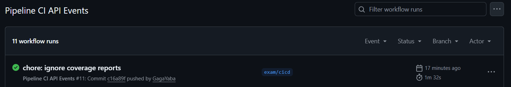
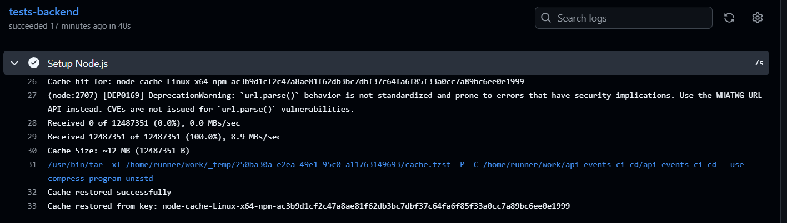

* Service PostgreSQL visible dans les logs CI

* Tests lances avec coverage
* Artifact `test-report-backend` visible dans GitHub Actions
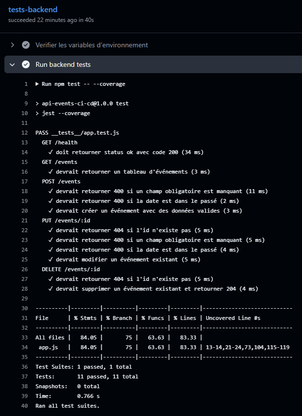

* Image Docker publiee sur GHCR avec les tags `latest` et SHA
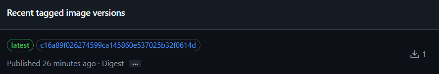

* Scan Trivy visible dans les logs
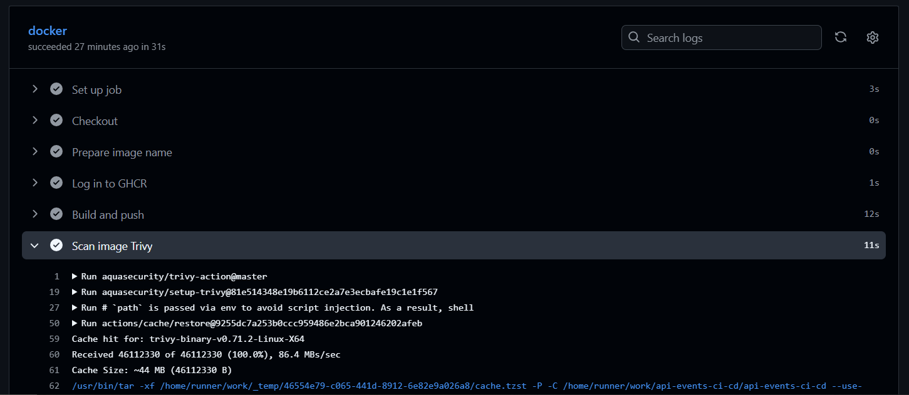

* Dependabot configure


* Secrets GitHub Actions crees
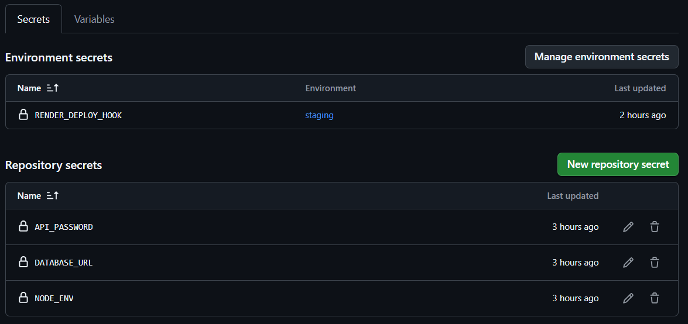

* Workflow Deploy declenche
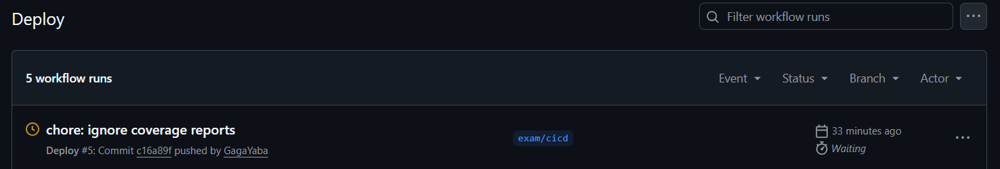

* Deploiement staging reussi via Render Deploy Hook
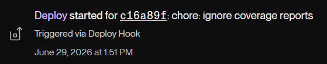

* Production bloquee en attente d'approbation
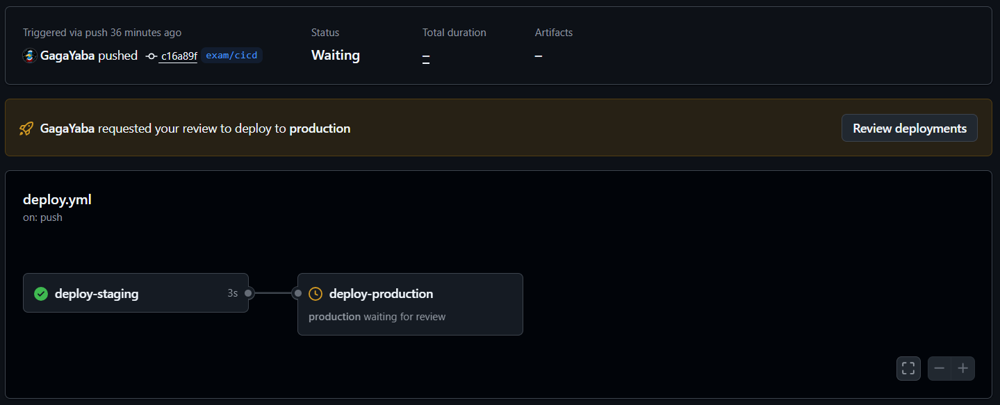

* Production validee manuellement
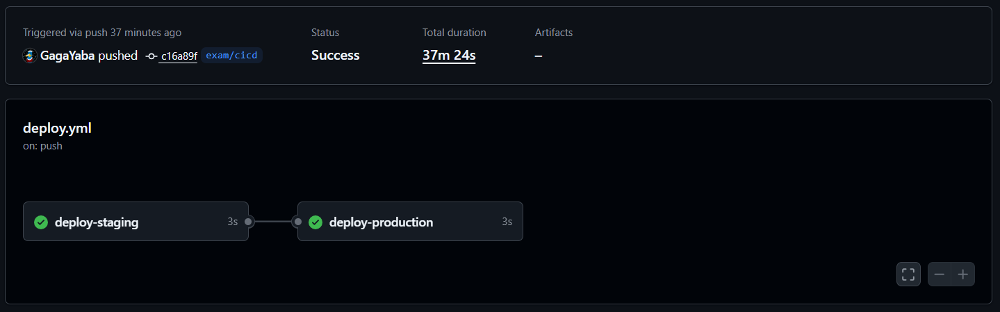

* Route `/health` accessible sur Render
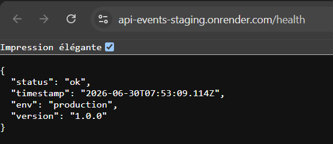

* Dashboard UptimeRobot en statut UP
* Monitor UptimeRobot configure sur `/health`
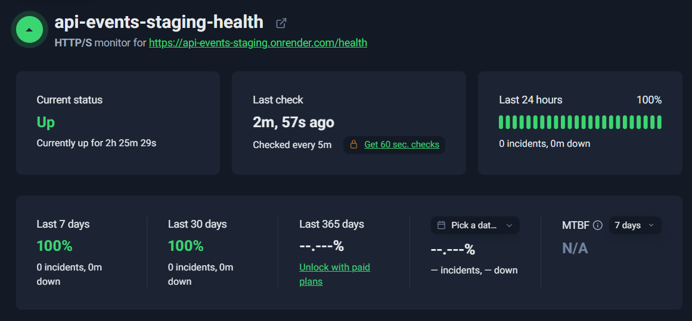


## Variables d’environnement nécessaires

Pour que la CI et le deploiement fonctionnent correctement, ces valeurs doivent etre configurees dans GitHub avec des placeholders, jamais de vraies valeurs dans le repo.

Secrets GitHub Actions :

```text
API_PASSWORD=<api-password>
DATABASE_URL=<production-database-url>
NODE_ENV=production
```

Secret d'environnement staging :

```text
RENDER_DEPLOY_HOOK=<render-deploy-hook-url>
```

Dans GitHub :

```text
Settings → Secrets and variables → Actions → New repository secret
```

